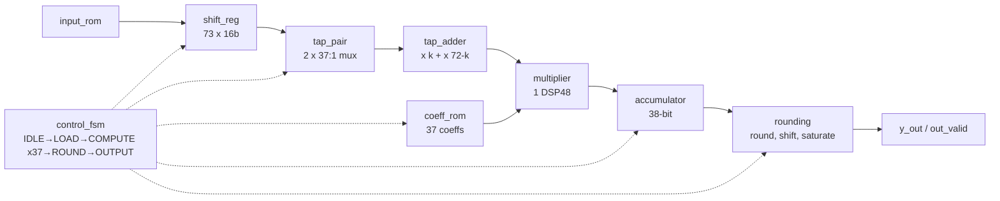

# 73-Tap FIR Filter: Design and FPGA Implementation

A 73-tap linear-phase FIR filter in SystemVerilog that processes **1 MSps** (one output per 1 µs) on a **Nexys A7 (Artix-7)** at 100 MHz. It uses a **single DSP48 multiplier**: symmetric taps are pre-added and one MAC is time-multiplexed under a control FSM.

Final project of the Chip Design & Verification (CHIP-DV) training at GIKI, supervised by Engr. Mashood.

**Team:** Abdul Samad Abbasi · Abdur Rehman Safdar ([original repo](https://github.com/Abdur-Rehman-Safdar/FIR-FILTER-73-TAPS-))

## Specs

| Parameter | Value |
|---|---|
| Taps | 73 (symmetric, h[k] = h[72−k]) |
| Throughput | 1 sample / µs (100 clock cycles at 100 MHz) |
| Input format | Q(3,10), 16-bit signed |
| Coefficients | Q(2,14), 16-bit signed, 37 unique values in ROM |
| Output format | Q(3,13), 16-bit signed, rounded and saturated |
| Accumulator | 38-bit (32-bit product + 6 guard bits) |
| Schedule | 40 cycles / sample (400 ns), so 60% of the time budget is spare |

## Architecture



Linear-phase symmetry cuts the multiplications from 73 to 37. Those 37 MACs then run one per clock cycle through one multiplier and one accumulator. A five-state Moore FSM handles the sequence:
- **LOAD:** shifts in the new sample and clears the accumulator
- **COMPUTE:** runs 37 MAC cycles
- **ROUND:** rounds the result
- **OUTPUT_READY:** latches the output and raises `out_valid`

## Repository layout

```
rtl/           top, shift_reg, tap_pair, tap_adder, coeff_rom, multiplier,
               accumulator, rounding, control_fsm, input_rom
golden_model/  golden_ref_model.cpp (bit-accurate C++ model),
               coeffs_fixed.txt, input_samples.txt, golden_output.txt
sim/           tb_fir.sv (self-checking, 100 vectors), shift_reg_test.sv, tap_pair_test.sv
docs/          project report (PDF), slides, block diagram, timeline
```

## Verification

`golden_ref_model.cpp` does three things:
- quantizes the coefficients and a 100-sample test signal to fixed point
- runs the filter bit-accurately, using the same round/shift/saturate rule as the hardware
- writes the hex vectors the testbench loads

`tb_fir.sv` feeds every sample and compares each `y_out` against the golden output. The project report records **all 100 samples matching (100% pass)**, covering both the linear region and the saturated plateau (outputs clamped at 32767).

> `tb_fir.sv` drives the simulation version of `top` (ports `start_bit`/`x_in`/`y_out`). That version is kept as a commented block at the top of `rtl/top.sv`. The active `top` is the FPGA build. To simulate, swap the two blocks.

## FPGA build (Nexys A7-100T)

In the FPGA top:
- the input samples come from `input_rom`
- the start button is debounced
- each output is stored in an output RAM
- the switches (`sw`) select which of the 100 results appears on the 16 LEDs

Utilization on the xc7a100tcsg324-1:

| Resource | Used | Util. |
|---|---|---|
| Slice LUTs | 553 | 0.87 % |
| Registers | 1219 | 0.96 % |
| DSP48E1 | 1 | 0.42 % |
| BRAM (RAMB18) | 1 | 0.37 % |

96% of the registers are the 73×16 shift register.

## Tools

SystemVerilog · Xilinx Vivado · C++ (golden model) · Nexys A7
